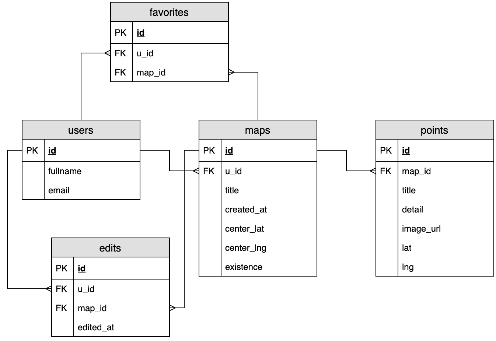

# DataTypes

## ERD



## Users

```js
{
  id: PK int,
  fullname: string,
  email: string,
}
```

## Maps

```js
{
  id: PK int,
  u_id: FK int,
  title: string,
  created_at: timestamp,
  center_lat: float,
  center_lng: float,
}
```

## Points

```js
{
  id: PK int,
  map_id: FK int,
  title: string,
  detail: string,
  image_url: string,
  lat: float,
  lng: float,
}
```

## Favorites

```js
{
  id: PK int,
  u_id: FK int,
  map_id: FK int,
}
```

## Edits

```js
{
  id: PK int,
  u_id: FK int,
  map_id: FK int,
  edited_at: timestamp,
}
```
